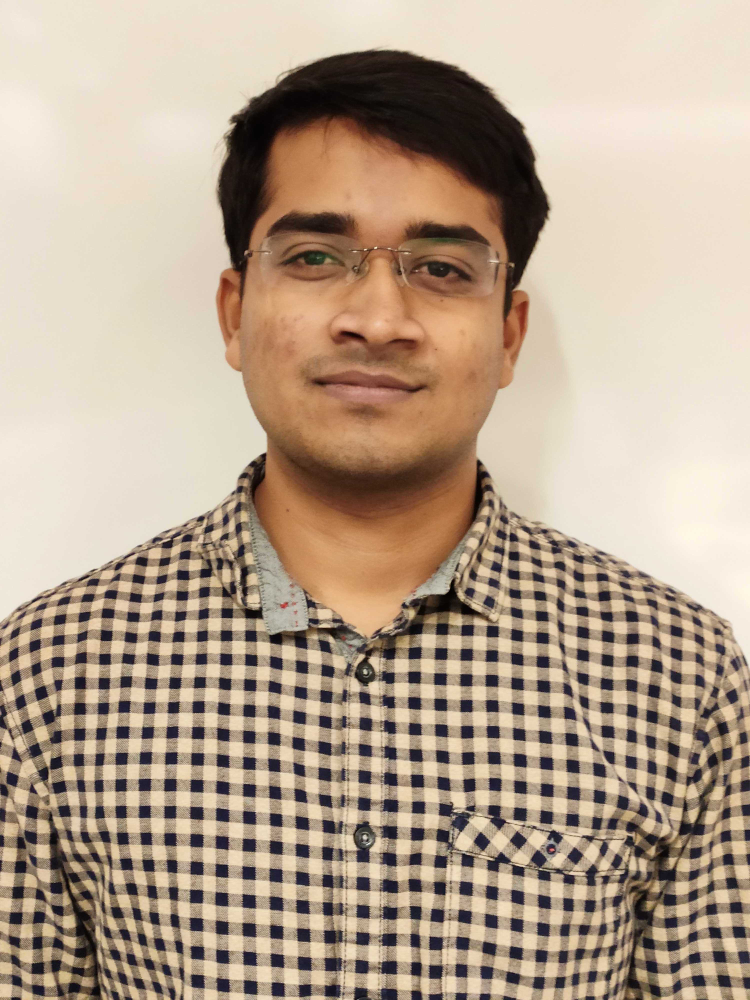

 

<a href="https://docs.google.com/document/d/1PHeJ6v4NmCRKsPWvZuGzKQSMarwrQDY-LxjdjHFwHt0/edit?usp=sharing" class="btn btn-dark" target="_blank">My Resume</a>

<a href="https://www.linkedin.com/in/nithish08" class="btn btn-dark" target="_blank">LinkedIn</a>

 

I am a business-minded Data Scientist with a proven experience of building solutions for diverse set of data science problems. I consider myself a lifelong learner of mathematics and AI.

I am currently a **Data Science Intern** at PG&E building cutting edge Deep Learning Computer Vision Models on drone imagery to detect defects in electrical grids.

Previously, I worked as a **Consultant** at [Fractal](https://fractal.ai/){:target="_blank"}. I have built demand forecasting models for Fortune-500 companies, and worked on using text data to predict stock price movements.

I will graduate from **Data Science Program** at University of San Francisco this June. I am now open to ML/DS opportunities.

Email ID: [nbolleddula@dons.usfca.edu](mailto:nbolleddula@dons.usfca.edu)