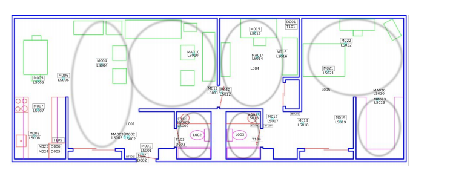

# [Machine Learning in distributed computing environment on big sensor data collected from smart homes](https://embc.s3-us-west-2.amazonaws.com/EMBC2020_SmartHomePrivacy.pdf)
**[PySpark, scikit-learn, MLlib, PCA, Big Data, Sensor Data]**

Our paper, “​Sensor Selection for Activity Classification
at Smart Home Environments” was accepted for presentation at the IEEE Engineering in Medicine and Biology Society Conference 2020, in Montréal, Québec, Canada.

---

# [Dilated Convolutionals, Gated Recurrent Units, Long-Short Term Memory Networks on Time-series data](https://github.com/nithish08/ml2-project)
**[PyTorch, CNN, GRU, LSTM, Time series modeling, Feature Engineering]**

As part of in-class modeling competition at [USF](https://www.usfca.edu/arts-sciences/graduate-programs/data-science), I have explored various deep learning techniques for modeling time-series data.

---
